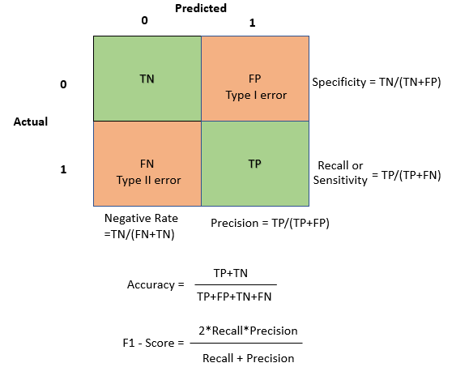

# MACHINE-LEARNING

**0)import packages**

**1)Data Load**

**2)Data to dataframe**

**3)Explotary data analysis**

-data.info() (discrete/continuous/ categorical/numerical)

-pairplot

-displot

-barplot

-scatter plot

-wordcloud

-label value count

**4)Pre-Processing**

**dublicated values**

data.duplicated()  (data.drop_duplicates())

**missing values**

data.isna()  (data.dropna()/data.fillna()

**Correlation detection**

data.corr()

data.drop(["correlated feature"],axis=1)

**Outlier Detection**

---Standart Deviation

---Box Plots/IQR Calculation

---Isolation Forest

drop outliers

**Feature Scaling**

-Standardization

-Normalization

*Data Binning

**Feature Extraction**

-Principle Component Analysis(PCA)

-Independent Component Analysis(ICA)

-Linear Discriminant Analysis(LDA)

-t-distributed stochastic neighbor Embeddings(t-SNE)

**Feature Encoding**

-Nominal-->One Hot Encoding

-Ordinal-->Label Encoding

**Train/Validation/Test**

-60/20/30

-70/30

-80/20

-cross validation

**5)Model selection, tuning parameters, training,test prediction**

hyperparameter tuning

fitting model to train data

predict test data

**6)Evaluation**

-Confusion matrix

-Precision,  Recall, Accuracy, F1 score

-ROC curve

-Comparison

-Optimization

-Regularization

**7)Deployment**

